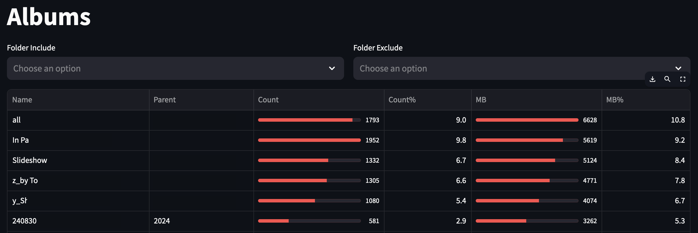
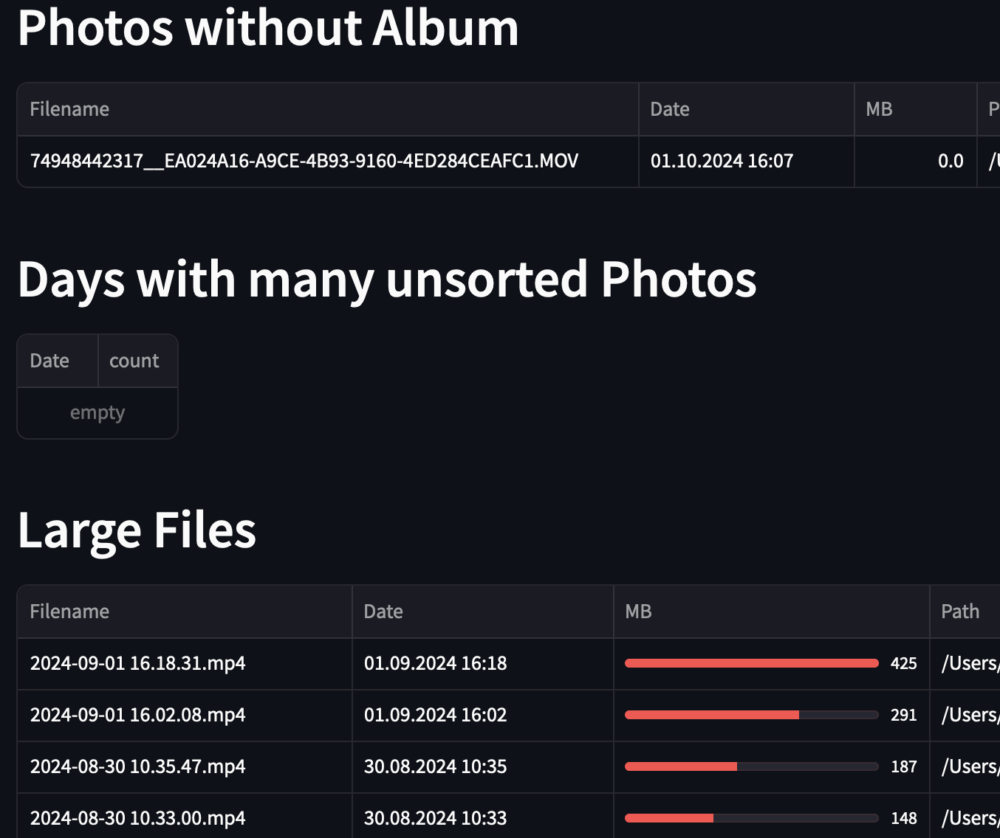

# Analyze your Mac Photos App Library

powered by [osxphotos](https://github.com/RhetTbull/osxphotos) and [Streamlit](https://github.com/streamlit/streamlit)

## Features

* find large photos/videos
* ranking of albums by MB and item count




## Repo Setup

### Install

see [install.sh](scripts/install.sh)

### Run

see [run.sh](scripts/run.sh)

### Check Code

```sh
pre-commit run --all-files
```

### Config

see [.streamlit/config.toml](.streamlit/config.toml)

## SonarQube Code Analysis

At [sonarcloud.io](https://sonarcloud.io/summary/overall?id=entorb_analyze-mac-photos&branch=main)
